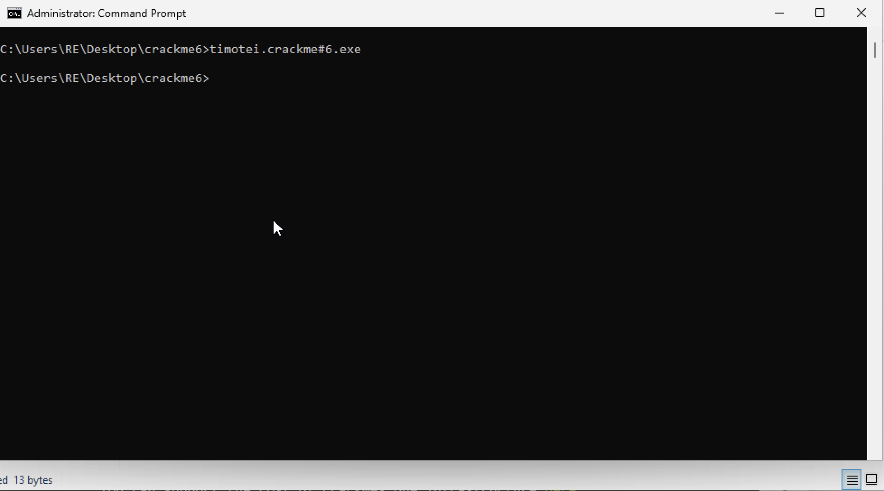
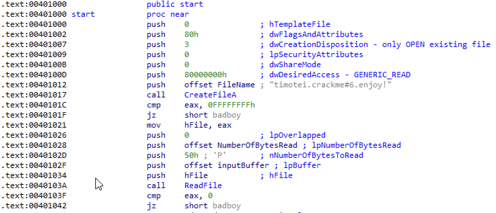
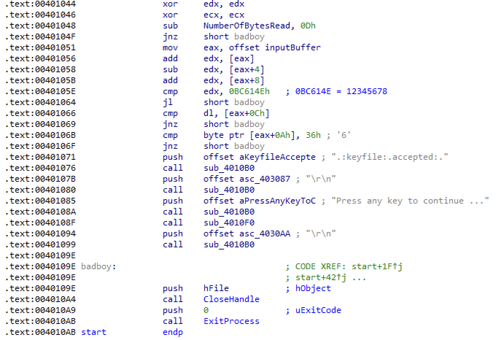
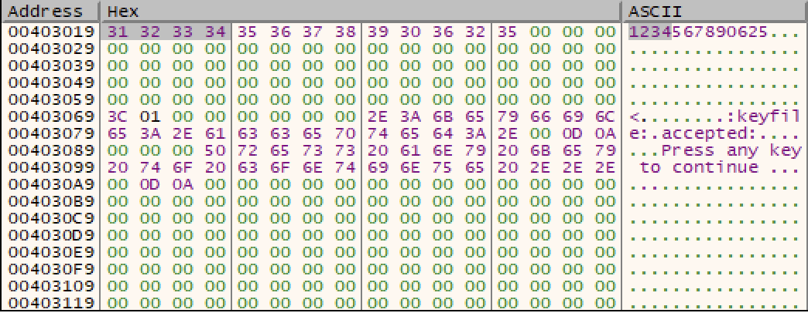
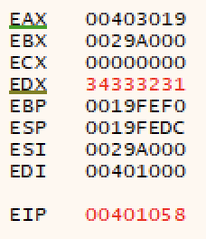
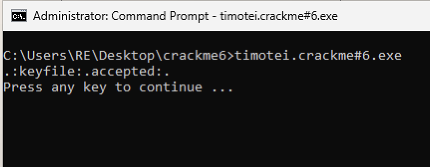

timotei crackme#6

source: https://crackmes.one/crackme/6452ba5533c5d43938912e35

# Initial impressions
Before analyzing the file, we can get a rough idea of what the program does just by running it.

Double clicking it just pops up a command line window for a split second before disappearing. So, this should probably be ran on the command line. Let's try that.

We don't get anything, huh? I think at this point it's a safe guess to assume this crackme is expecting some type of keyfile, probably in the form of a file in the same directory (this is also obvious from just looking at the crackme page).

We can probably expect to see some file handling APIs being called. Let's load it up in IDA.

# Static Analysis

Please excuse the mouse pointer :p

As expected, we see a call to both `CreateFileA` and `ReadFile`. A quick consultation with the Win32 API tells us the first function call will try to open an existing file with the specified `lpFileName` (in this case, timotei.crackme#6.enjoy!).

I've marked in IDA that the `dwCreationDisposition` parameter specifies that we are only interested in opening an *already existing* file. In other words, we need to supply this file.

`dwDesiredAccess` also shows that we are only reading the file and won't be doing any writing.

The result of `CreateFileA` is stored in `EAX`, and if it returns `INVALID_HANDLE_VALUE` (`0xFFFFFFFF`), we jump to `badboy` (thank you for the naming convention, lena!) which will close the handle and exit the process.

We'll then read in `50h` bytes into `inputBuffer`, storing the amount of characters read into `NumberOfBytesRead`.

The result of `ReadFile`, stored in `EAX`, is compared against `0`. Per the Win32 API documentation, `ReadFile` is successful if the return value is non-zero.

After clearing up some registers, we subtract `0xD` (13) from the number of bytes read. If the result is non-zero, we jump to `badboy`. In other words, the input needs to be 13 bytes in length. At this point, we begin the actual key calculation.

Let's focus on `.text:00401056-B`. It appears we are loading some data from `EAX` (which is holding the `inputBuffer`), and adding and subtracting specific parts of it. It's important to remember that our array exists as a contiguous stream of bytes in our `.data` section, and as we can see with `[eax]`, `[eax+4]`, and `[eax+8]`, we are accessing an `EAX`-worth of data at a time: one `dword`, or four bytes. As our characters are all each one byte (assuming we are using ASCII or basic UTF-8 glyphs), this means the first `add` is adding the first four bytes at once. However, they may not be added in the way you think they are. Let's take a look at this in `x32dbg`.

# x32dbg

We'll go ahead and jump to this `add` instruction on `00401056`. First, let's follow `[eax]` in the dump.

As we can see, this `add` instruction is grabbing these four bytes as they exist independent of each other. Once it's moved into the register we see:

As we are working in little-endian, the order of the bytes is reversed.

So, it would be appropriate to describe this operation as grabbing the first four bytes of the user input, reversing the order, converting each character into it's corresponding ASCII equivalent, and building a `dword` out of it.

The following `sub` operation does this with characters five to eight, and the final `add` operation does it with character nine to 12. The result is stored in `EDX`.

Once these are summed up, we compare it to `0x0BC614E`, or 12345678.

Using 1234567890123 satisfies this condition.

On `00401066`, we are now comparing the last byte of the string input to `DL`. If you recall that `EDX` stores the summed value from earlier, this means that the last digit of the key must equal the lowest byte of our summed numbers. In our case, with the string mentioned above, `DL` would be 35, or '5' in ASCII. Let's update our string.

1234567890125

We have one final check before we can validate our key, on line `0040106B`, with `cmp byte ptr [eax+0Ah], 36h`.

So, just change the 11th (`0x0A` = 10d, with zero index, is the 11th element) element to `0x36`, which happens to be '6' in ASCII.

Giving us the final key:

1234567890625

et voilà!

___

*If you're wondering why we're able to just replace this character without effecting the summation function that happens before the individual digit checks, it's because the result is large enough that changing the second `1` won't result in it being lower than 12345678. If the 'encryption' were more robust, this almost certainly would not be the case.*